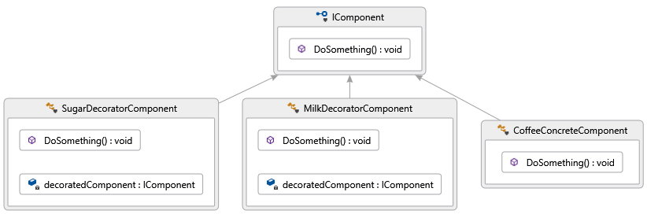

## SRP Patterns
Patterns that ensure single resposibility principle.

### Decorator pattern
[Deorator pattern](https://en.wikipedia.org/wiki/Decorator_pattern) (wrapper) add bahaviour to an object. 
In my sample, I add behaviour/flavour to coffee. I do it run-time using interface as opposed to inheritance=compile-time.

### Composite pattern
The [composite pattern](https://en.wikipedia.org/wiki/Composite_pattern) describe a group 
of object treated the same way as a single instance. Decorator wrap one object, wheras 
composite wrap a list of objects.

### Predicate Decorator pattern
Hide conditional execution from client.

### Branching decorator pattern
Two execution paths, one for true, another for false. Depend on the supplied predicate test.

### Logging Decorator
Sample of decorating a simple one operation calculator instance with logging.