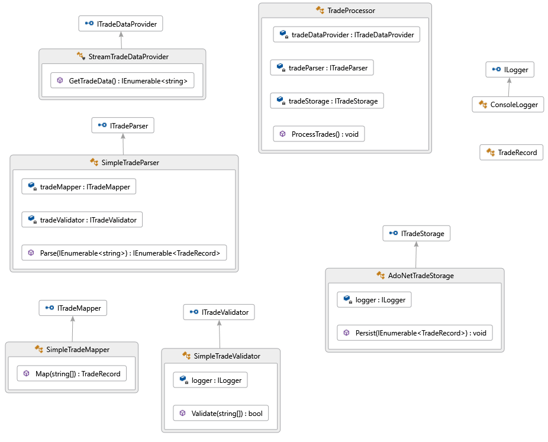

## Refactoring TradeProcessor
This is the road to refactoring the TradeProcessor so that it has only one reason to change. 
You need the book to follow all the details of the steps.

The initial version needed some mods for 
[decimal separator](https://github.com/Systemutvikler/AdaptiveCode2e/commit/e4f9cf8a8ac08eb59bac09f149ed9fdd2ef58516#diff-ad1f1a72f37a21eb4b0d345f5876efd2) 
and connection string.

1. [Refactoring for clarity](https://github.com/Systemutvikler/AdaptiveCode2e/commit/12857bca1e6d9053ed383cd37b82761a805118dc?diff=split). 
Split up ProcessTrades() function into three new functions for the tasks; 
reading, processing and storing.
2. Refactoring for abstraction. Introduce interfaces for the three high level tasks, and some. 
This is a massive undertaking. Going from one unmaintainable file to 6 new interfaces, 
6 new classes and two new projects. (Should have been split into several smaller steps)

